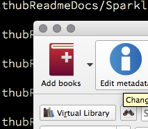
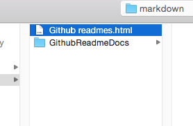
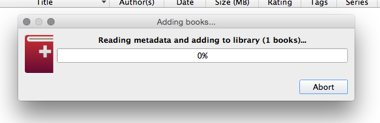
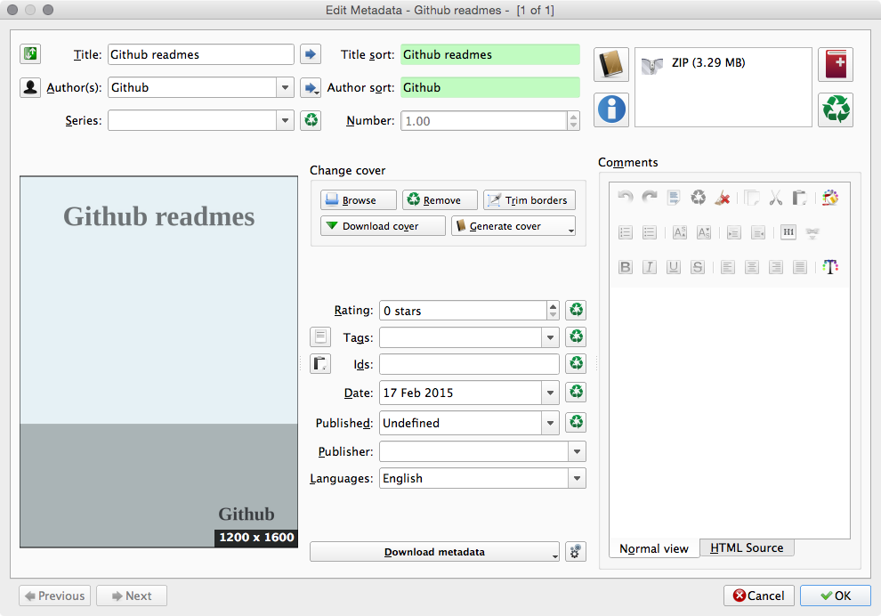
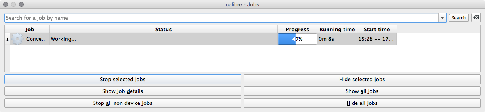
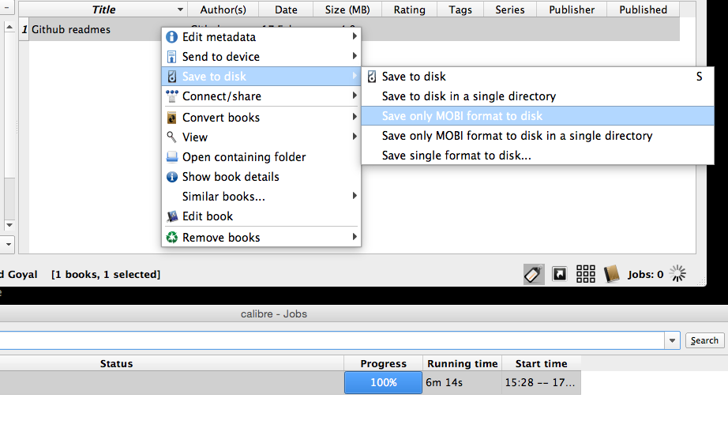
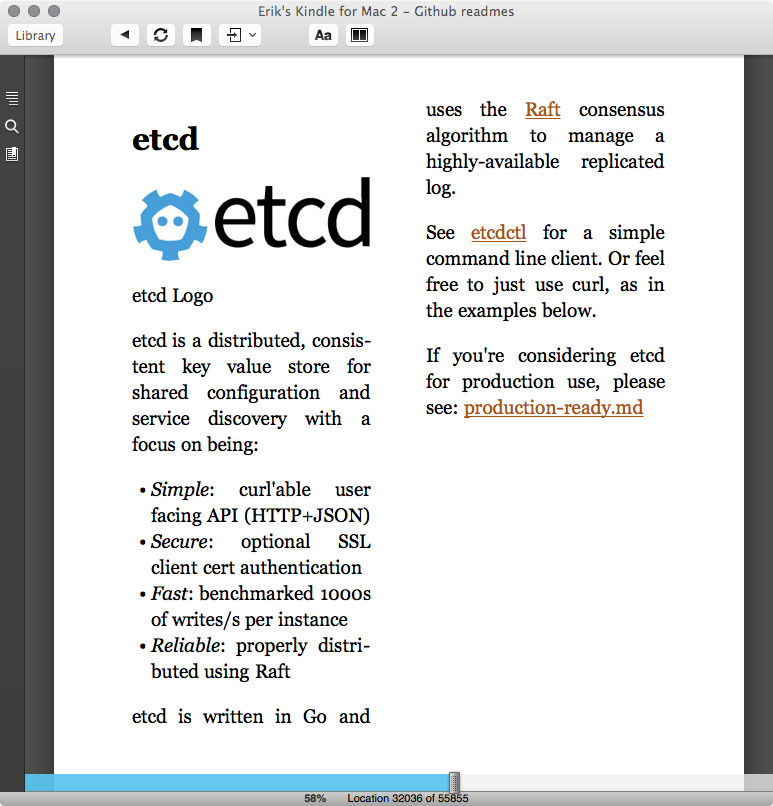

# github-md5-ebook
Loops a directory with github projects, scans for documentation and readme's. And builds a html-version compatible with Calibre

##Convert .md files to an ebook
####Prerequisites
* ebook converter
* Calibre: http://calibre-ebook.com/download

```bash
# install ebook converter
$ npm install -g ebook
```

####Step 1
Put md5 files in a folder inside of the markdown directory

```bash
$ pwd
~/workspace/research/md2html

$ ls markdown/
total 0
0 drwxr-xr-x+   3 rabshakeh  102 Feb 17 15:45 .
0 drwxr-xr-x+   9 rabshakeh  306 Feb 17 15:45 ..
0 drwxr-xr-x+ 133 rabshakeh 4.5K Feb 17 15:17 GithubReadmeDocs

$ ls markdown/GithubReadmeDocs | wc
    134    1199    7748
```

####Step 2
Run the md2html python script, this will convert all .md files to .html, and generates a table of content

```bash
$ python md2html.py
convert: markdown/GithubReadmeDocs/coffee-script/test/importing 2 items
...
```

####Step 4
Open Calibre and click 'add books' 



####Step 5
Select the generated table of contents html file



Wait for Calibre reading the files



####Step 6
Right click the book to convert it


Optionally right click the ebook to change the metadata



Wait for the converson to finish



####Step 7
When done, right click to save the book



####Result
Kindle on Mac




##Extra, make an ebook of all your cloned github projects
Run one of the collection scripts, and put the results in the markdown folder, continue at step 1

```bash
# collects all the readme's from ~/workspace/github into a local github directory
$ python get_github_readmes.py

# collects all the readme's and doc directories from ~/workspace/github into a local github directory
$ python get_github_readme_and_docs.py
```


